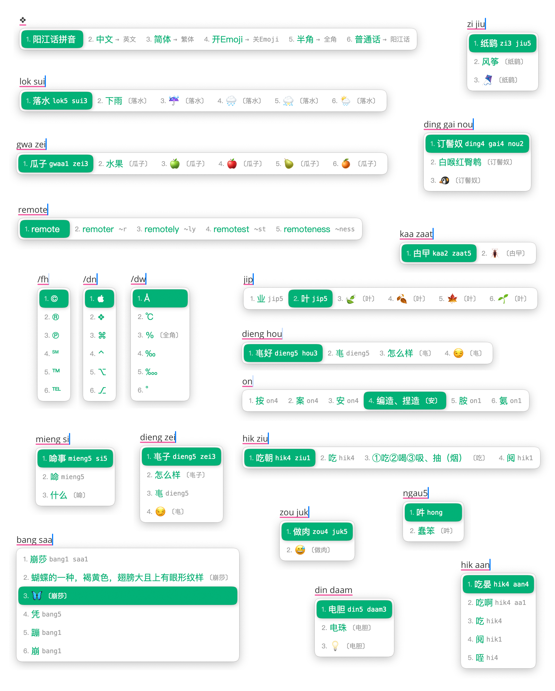
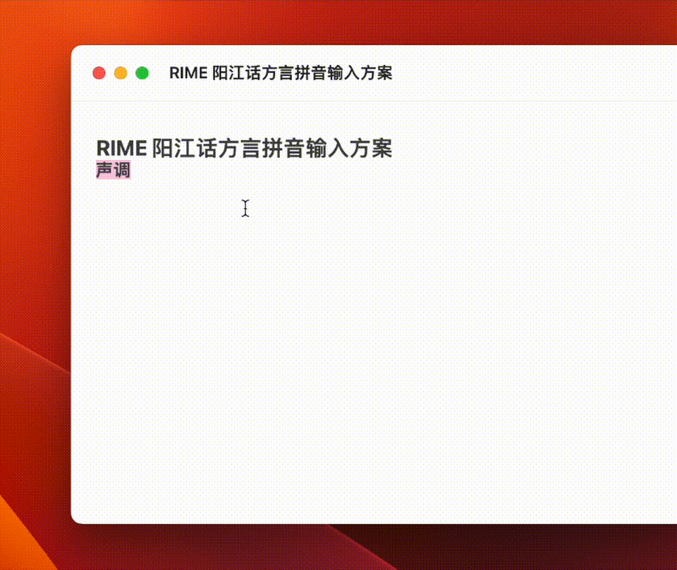
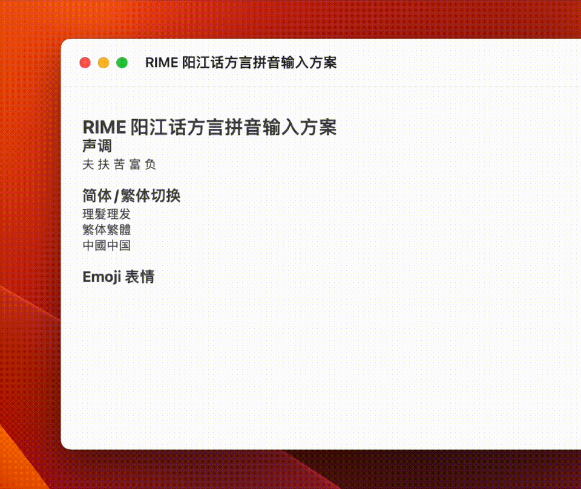
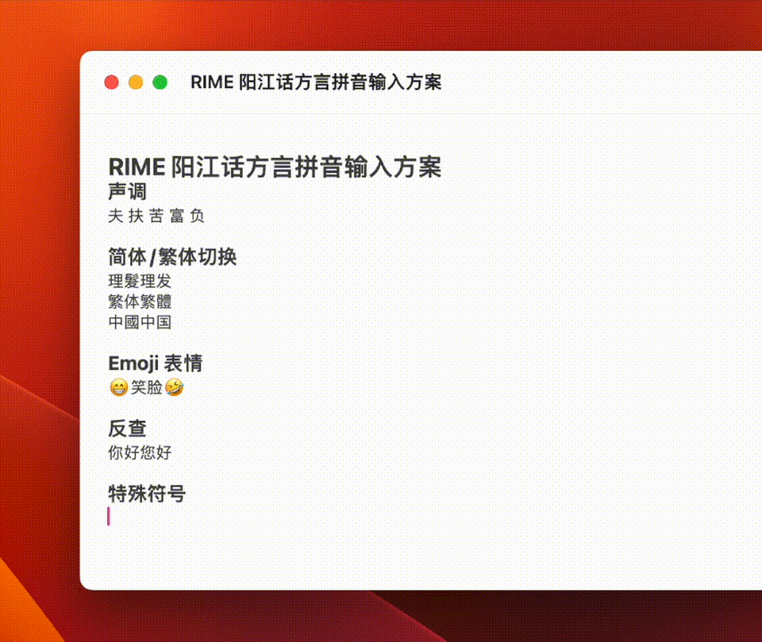

# Rime 阳江话拼音输入方案

我手写我心的阳江话拼音输入方案🫶🏻




## 前置说明

**[RIME 输入法安装](https://lumen01.github.io/jienggongwaa/01.rime-installation.html)**

　　阳江话拼音输入方案基于 RIME 输入法引擎实现，要使用阳江话拼音打字，首先安装 RIME 输入法。

**[阳江话拼音方案](https://lumen01.github.io/jienggongwaa/03.jienggongwaa-pingjam.html)**

　　先了解这部分拼音的内容，才能流畅的使用阳江话拼音打字。

## 方案快速上手指南

### 声调输入

方案支持声调输入。

在输入拼音字母之后，可以继续输入声调来缩小选字范围，提升输入效率：



1. `q`: 一声，输入`fuq` 打出 「夫」
2. `r`: 二声，输入`fur`打出「扶」
3. `v`: 三声，输入`fuv`打出「府」
4. `qq`: 四声，输入`fuqq`打出「富」
5. `rr`: 五声，输入`furr`打出「负」

### 容错、模糊音及简化输入

#### 模糊音

##### [gw-] 和 [kw-] 的消失

在有些地方，年轻人已经不区分`瓜`和`家`了，都读作`家`；不区分`夸`和`卡`，都读作`卡`  ，意味着 `[gw-]` 和 `[kw-]` 正在消失。

如果你的习惯是不区分，这个时候可以调整方案文件 `jienggong.schema.yaml` 的 `speller/algebra:` 下的内容：

```yaml
    # 取消以下一行的注释，将 gw-, kw- 并入 g, k，「瓜」读作「家」，「夸」读作「卡」
    - derive/^(g|k)w([aeiou])/$1$2/
```

##### 海话母语人群的 [sl]  声母

阳江市境内的海话母语人群遇到声母 `[sl]` 的时候都发声母 `[s]` 的音，本方案也做了兼容。

```yaml
    # 对于讲海话个人, 根据习惯, 遇到 [sl] 音都发 [s], 因此
    # 取消下一行注释, 将 sl 并入 s, 「星」读作「声」, 「姓」读作「胜」
    - derive/^sl([aeiou])/s$1/
```

***注意：这是输入方案层面的兼容，并不代表拼音如此***

#### 容错

实现输入 `jieng` 和 `yieng` 都得到 `jieng` 的结果：

```yaml
    - derive/^j([aeiou])/y$1/     # 容错 j -> y
```

以上功能默认开启的同时，不影响原来 `j` 的输入。

#### 简化输入

阳江话有一个比较特别的声母 `[ɬ]` ，这个音在现代汉语普通话里面是没有的。

在这个拼音方案里使用 `sl` 两个字母来输入，同时这个方案也支持使用 `x` 来简化 `sl` 的输入：

```yaml
    # 取消下一行注释, 优化 x -> sl, 输入[x] 可以得到输入 [sl] 的效果，提升输入效率
    - derive/^sl([aeiou])/x$1/
```

以上功能默认开启的同时，不影响原来 `sl` 的输入。

### 简体/繁体切换

方案支持简体和繁体输入。


### Emoji 输入

蠄蟧 `🕷️`、纸鹞 `🪁`、崩莎 `🦋`



### 英文输入

本方案支持中英混输，直接打英文单词即可。


输入英文单词之后，方案会自动在单词之后补充一个空格，如果不需要这个功能，可以把`engine/filters`内的行注释掉：

```yaml
    - lua_filter@*en_spacer
```

### 反查

当遇到一时无法想起阳江话拼音个时候，按**`**键（在数字键 1 的左边）可以使用普通话拼音反查阳江话拼音。


### 特殊符号

输入`/`开启特殊符号的输入。



要完全了解本方案功能请前往 **[阳江话拼音方案详细介绍](https://lumen01.github.io/jienggongwaa/04.rime-jienggongwaa-details.html)** 

## 结语❤️

很高兴阳江话拼音输入方案能够帮助到您。

本项目长期更新，欢迎提 [PR](https://github.com/Lumen01/rime-jienggong-cantonese/pulls) :-)

最后，祝打字愉快 🫶🏻
