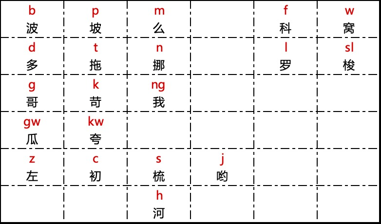
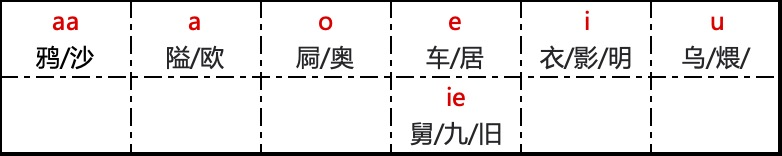
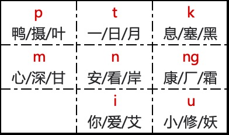
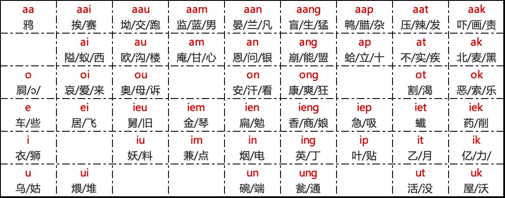
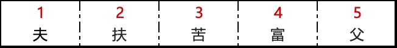

# Rime 阳江话拼音输入方案

## 说明

读音来源：《广东阳江方言研究》（2018，中山大学）

已覆盖《现代汉语常用字表》常用字 2500 字中的 2263 字，次常用字 1000 字中的 381 字。

收集来源：

《现代汉语常用字表》

[常用字(2500字)](https://www.zdic.net/zd/zb/cc1/)  

[次常用字(1000字)](https://www.zdic.net/zd/zb/cc2/)

## RIME 方案使用说明

#### 声调输入

在输入拼音字母之后，可以继续输入声调来缩小选字范围，提升输入效率：

1. `q`: 一声
2. `r`: 二声
3. `v`: 三声
4. `x`: 四声
5. `qq`: 五声

#### 模糊音输入

有些地方不区分`瓜`和`家`，都读作`家`；不区分`夸`和`卡`，都读作`卡`  可以调整 `jienggong.schema.yaml`：

```yaml
# 取消以下一行的注释，将 gw-, kw- 并入 g, k，[瓜]读作[家]，[夸]读作[卡]
- derive/[gk]w/$1/
```

#### 简体/繁体切换

#### Emoji 输入

#### 英文输入

#### 反查

#### 特殊符号

## 阳江话拼音的声、韵、调

#### 声母



-  声母 **[sl]** 实为 **[[ɬ](https://zh.wikipedia.org/wiki/清齒齦邊擦音)]** ，但 QWERTY 键盘没有这个键，所以使用 **[sl]** 两个字母键作为替换。
- 部分零声母开又韵的字音开头有喉塞音 **[ʔ]** ，如“英” **[ʔiŋ]** 、 “益” **[ʔik]** 等，我们将其简化为零声母，不标出来。

#### 韵腹



#### 韵尾



#### 韵母




#### 鼻辅音韵母


- 它们不和声母相拼，只做叹词用。

#### 声调



声调标在音节后面，如 **fu1（夫）**，**fu2 （扶）**。
