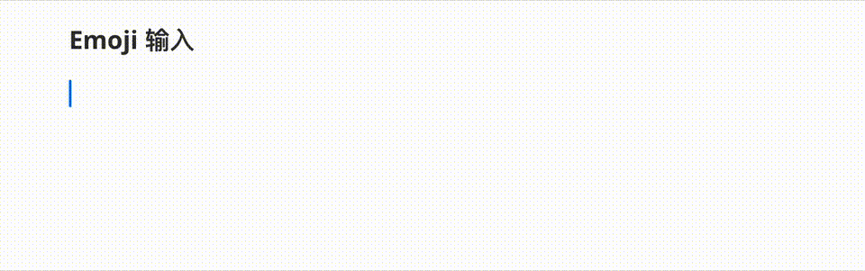
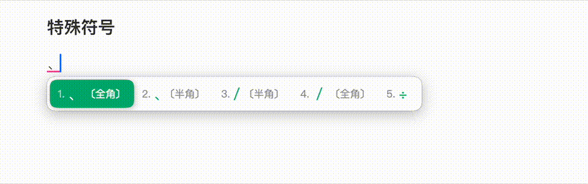
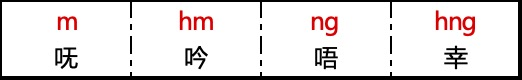

# Rime 阳江话拼音输入方案

[toc]

## 说明

读音来源：《广东阳江方言研究》（2018，中山大学）

本方案已覆盖《现代汉语常用字表》常用字 3500 字。详见 [常用字(2500字)](https://www.zdic.net/zd/zb/cc1/)  和 [次常用字(1000字)](https://www.zdic.net/zd/zb/cc2/)。

基本单字词典：`dicts/jienggong.chars.dict.yaml` 

手工补充单字词典：`dicts/jienggong_manual.chars.dict.yaml`

## RIME 输入法下载和安装

[RIME 官方网站](https://rime.im)

[RIME 输入法引擎下载](https://rime.im/download/) 

[RIME 官方 Wiki 文档](https://github.com/rime/home/wiki)

## 方案基本功能说明

### 声调输入

方案支持声调输入。

在输入拼音字母之后，可以继续输入声调来缩小选字范围，提升输入效率：


1. `q`: 一声，输入`fuq` 打出 「夫」
2. `r`: 二声，输入`fur`打出「扶」
3. `v`: 三声，输入`fuv`打出「府」
4. `qq`: 四声，输入`fuqq`打出「富」
5. `rr`: 五声，输入`furr`打出「负」

### 容错、模糊音及简化输入

#### 模糊音

##### [gw-] 和 [kw-] 的消失

在有些地方，年轻人已经不区分`瓜`和`家`了，都读作`家`；不区分`夸`和`卡`，都读作`卡`  ，意味着**[gw-]**和**[kw-]**正在消失。

如果你的习惯是不区分，这个时候可以调整方案文件 `jienggong.schema.yaml` 的 `speller/algebra:` 下的内容：

```yaml
    # 取消以下一行的注释，将 gw-, kw- 并入 g, k，「瓜」读作「家」，「夸」读作「卡」
    - derive/^(g|k)w([aeiou])/$1$2/
```

##### 海话母语人群的 [sl]  声母

阳江市境内的海话母语人群遇到声母[sl]的时候都发声母[s]的音，本方案也做了兼容。

```yaml
    # 对于讲海话个人, 根据习惯, 遇到 [sl] 音都发 [s], 因此
    # 取消下一行注释, 将 sl 并入 s, 「星」读作「声」, 「姓」读作「胜」
    - derive/^sl([aeiou])/s$1/
```

#### 容错

实现输入 `jieng` 和 `yieng` 都得到 `jieng` 的结果：

```yaml
    - derive/^j([aeiou])/y$1/     # 容错 j -> y
```

以上功能默认开启的同时，不影响原来 `j` 的输入。

#### 简化输入

阳江话有一个比较特别的声母 `[ɬ]` ，这个音在现代汉语普通话里面是没有的。

在这个拼音方案里使用 `sl` 两个字母来输入，同时这个方案也支持使用 `x` 来简化 `sl` 的输入：

```yaml
    # 取消下一行注释, 优化 x -> sl, 输入[x] 可以得到输入 [sl] 的效果，提升输入效率
    - derive/^sl([aeiou])/x$1/
```

以上功能默认开启的同时，不影响原来 `sl` 的输入。

### 简体/繁体切换

方案支持简体和繁体输入。


### Emoji 输入



### 英文输入

本方案支持中英混输，直接打英文单词即可。

### 反查

当遇到一时无法想起阳江话拼音个时候，按**`**键可以使用普通话拼音反查阳江话拼音。


### 特殊符号

输入`/`开启特殊符号的输入。



## 阳江话拼音的声、韵、调

在真正开始打字之前，你还需要学习一下阳江话的拼音。

这个方案参考了 [香港语言学学会粤语拼音方案](https://jyutping.org/jyutping/)，所以两个方案非常相似，有粤语和阳江话基础的前提下，只要花大约一两小时就可以一并学会本阳江话拼音和 [粤拼](https://lshk.org/jyutping-scheme/) 。

### 声母

连同零声母在内，阳江话一共有 21 个声母。


-  声母 **[sl]** 发音为 **[[ɬ](https://zh.wikipedia.org/wiki/清齒齦邊擦音)]** ，但 QWERTY 键盘没有这个键，所以使用 **[sl]** 两个字母键作为它的拼音输入。
- 部分零声母开又韵的字音开头有喉塞音 **[ʔ]** ，如“英” **[ʔiŋ]** 、 “益” **[ʔik]** 等，我们将其简化为零声母，不标出来。

### 韵腹


### 韵尾


### 韵母


### 鼻辅音韵母



- 它们不和声母相拼，只做叹词用。

### 声调


声调标在音节后面，如 **fu1（夫）**，**fu2 （扶）**。
